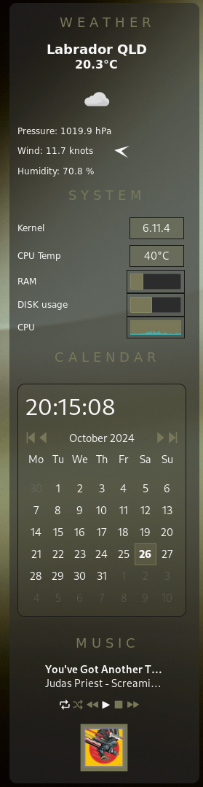
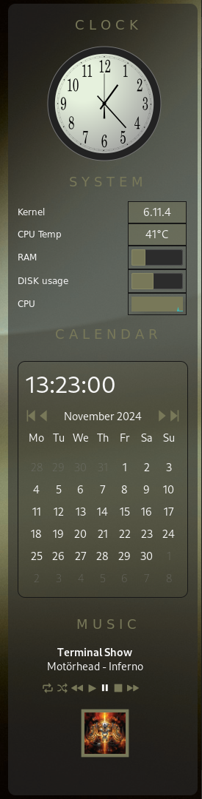
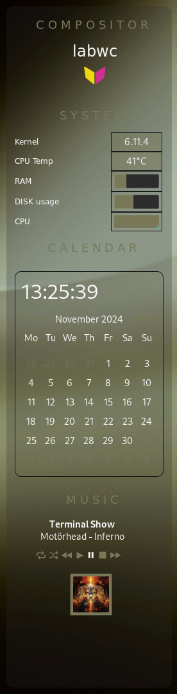

# Side bar

These config files enable a sidebar displaying differnt _widgets_
There are a number to choose from and you can use as many or few as you like
depending upon screen real estate.

### Screen shots

  

### Usage

Put these configs in your `~/.config/sfwbar` directory. You can start the
sidebar calling the `.config` file of your choice.

Run with:

```
sfwbar -f sidebar-rhs-weather.config
```

You can also put the configs in a subdir, for example `sidebar/`. This keeps your
maing confdir tidy.

```
sfwbar -f sidebar/sidebar-rhs-weather.config

```

### Changing things

The configs use a simple `include()` so it's easy to change things around.

#### Weather

Change your `lat, long` settings in you `weather-side.widget`

Change to "C" for Celcius or "F" if you want Fahrenheit in main config:
`sidebar-rhs-weather.config`

#### Clock

Choose from different clock faces. In the `analog-clock.widget` there is 

```
include("analog-jp.source")
#include("analog-clock.source")
#include("analog-plain.source")
#include("zigbert-clock.source")
#include("zigbert-clock-roman.source")
#include("analog-swiss-rail.source")

```

Leave any one uncommented ( `#` are used for comments).

Each differnet `.source` file is a different clock style. You can of course
create your own `.source` file and include that as well.

# labwc

This is just a simple widget displaying the compositor name and icon _hard_
coded. Just change things up if you use `sway` or `river` or whatever.

### Bugs

File any bugs to [Issues](https://github.com/01micko/sfwbar-configs/issues)
