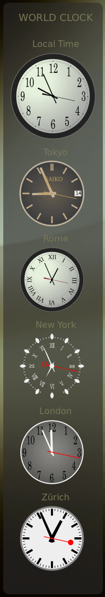
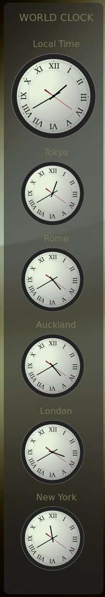

# World Clock

These config files enable a sidebar displaying world times on simple 
`svg` clock dials on screen on the right by default. That can changed by
editing the `-GtkWidget-direction:` propertin the the `#CSS` section of
the config to `left`.

### Screen shots

 

### Usage

Put these configs in your `~/.config/sfwbar` directory. You can start the
sidebar calling the `.config` file of your choice.

Run with:

```
sfwbar -f world-clock.config
```

You can also put the configs in a subdir, for example `clocks/`. This keeps your
main confdir tidy.

```
sfwbar -f clocks/world-clock.config

```

### Changing things

Clock styles and timezone are set in each separate widget. At the top the
time zone is set. For example:

```
Time("%H", "EST5EDT,M3.2.0,M11.1.0") # New York

```

The easiest way to find the required timezone is to query the timezone file,
like so:

```
$> CITY=New_York
$> find /usr/share/zoneinfo/ -type f -name "$CITY" |xargs tail -n1
$> EST5EDT,M3.2.0,M11.1.0

```

That's probably easier than changing the time on your microwave oven!

You can change the clock faces in the `svg` component of the config to any
circular image you like so long as the angle variables (clock hands) in
the `svg =` definition are preserved. These are the engine of each clock
and every different timezone needs a unique variable.

You can even use a `png` image stuffed into the `svg =` definition making
sure again to preserve the clock hand code. See the `analog-Japan.widget`
for an example.

### Bugs

File any bugs to [Issues](https://github.com/01micko/sfwbar-configs/issues)
