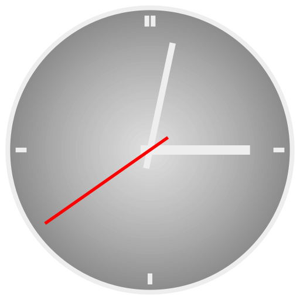
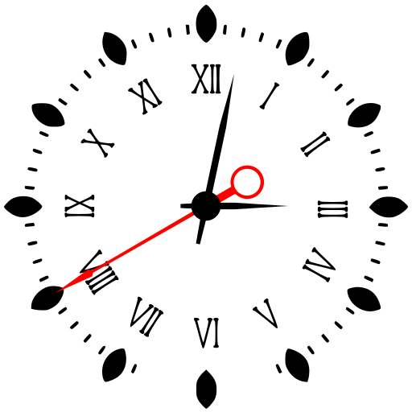
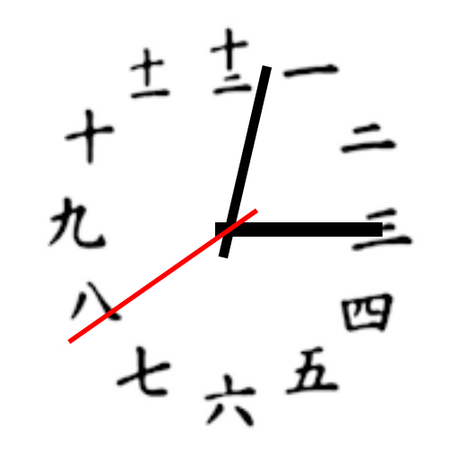
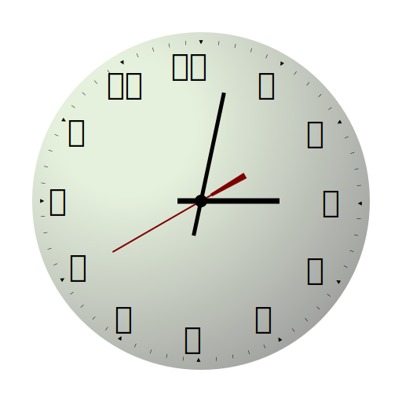
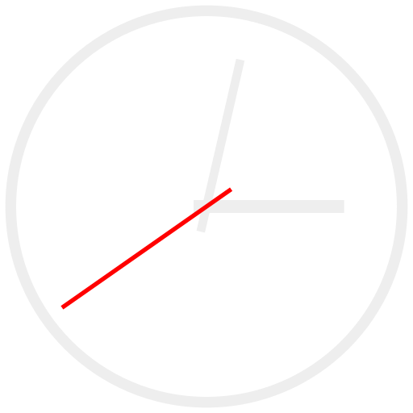
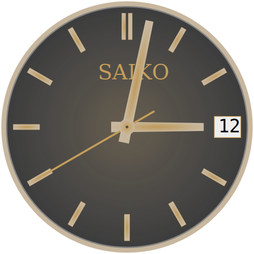
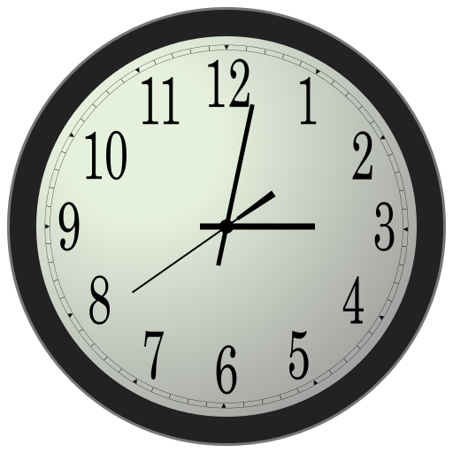
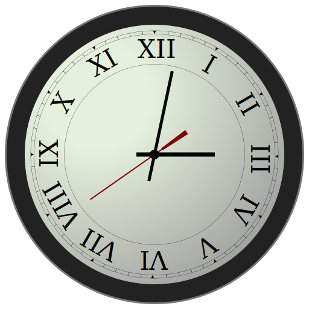

# SVG Gallery

Here is a preview of all the available clocks for the `sfwbar`	widgets
in this repository.

## Licence CC0 or GPL-2.0

### Analog Clock

This is a plain design with a dark background.

### Fancy Clock

A Roman Numeral clock with a fancy design. Found at the following
[link](https://svgsilh.com/image/2939419.html). `CC0` licence.

### JP Clock

Demonstrates an embedded `png` clock face with Japanese Numerals.

 `CC0`

### Oriental Clock

A simple design with Japanese Numerals. Chinses numerals are almost the
same.

 `CC0`

### Plain Clock

A plain and simple design.

 `CC0`

### Saiko Clock

A design based on Seiko watch. This is an interpretation only and not a
a blatant rip off.

 `CC0`

### Swiss Rail Clock

A design based off the Swiss Railways Clock. Again, this is an
interpretation only and not a blatant rip off.

 `CC0`

### Zigbert Clock

@zigbert is a developer on github whom I have collaborated with in the
past. This is his design. The source code is [here](https://github.com/puppylinux-woof-CE/woof-CE/blob/testing/woof-code/rootfs-skeleton/usr/lib/gtkdialog/svg_analogclock).

 `GPL-2.0`

### Zigbert Roman

Just the `analog-zigbert.svg` with Roman numerals instead.

 `GPL-2.0`

### Steamboat Willie (Mickey Mouse)

A `png` snapshot straight out of the cartoon movie, manipulated (mutilated?)
in `GIMP` and embedded as `base64` into the `svg`. `Public Domain`

 `GPL-2.0`
